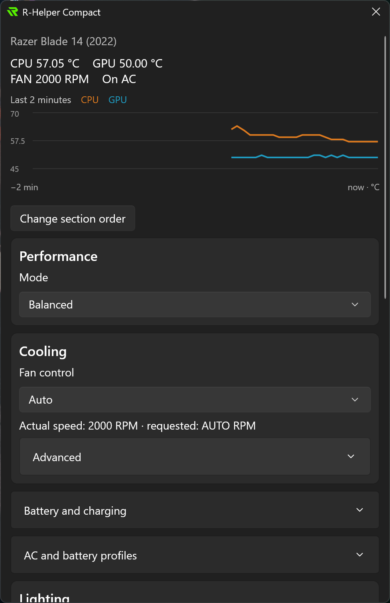
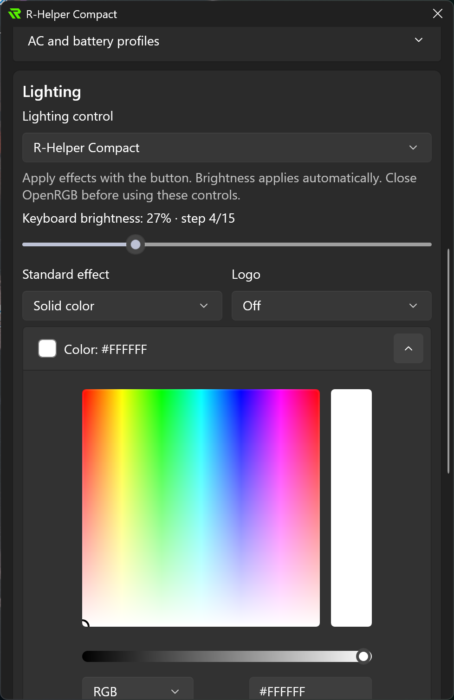

# R-Helper Compact


Control performance modes, fan speeds, keyboard lighting and battery charge limits on Razer Blade laptops from the Windows system tray.

[Releases](https://github.com/e-khurmamatov/r-helper-compact/releases) · [Report an issue](https://github.com/e-khurmamatov/r-helper-compact/issues/new/choose) · [Русский](README.ru.md)

## Features

- Performance modes, fan control and battery charge limits.
- Two-minute CPU/GPU temperature charts and adaptive background polling.
- Keyboard lighting effects and an option to leave lighting to OpenRGB.
- AC/battery profiles and Cooling Pad controls.
- Reorderable sections, startup settings and automatic UI language selection.

## Screenshots

<p>
  
  &nbsp;&nbsp;&nbsp;&nbsp;
  
</p>

Razer Blade 14 (2022). Available controls depend on the laptop model.

## Install

Download the x64 MSI or portable ZIP from Releases. The MSI installs to Program Files; extract the entire portable ZIP before running `rhelper-compact.exe`. Left-click the tray icon to open settings; right-click for quick controls and Quit. Close the app before upgrading.

Settings are stored in `%APPDATA%/r-helper-compact/`. English and Russian are included; the app follows the Windows display language and falls back to English. Override it under **Application → Preferences → Language**, then quit from the tray menu and reopen the app. Builds are currently unsigned.

Open **Application → Check for updates** to check GitHub Releases. Installed copies can download a verified MSI and restart after updating; Windows may request administrator permission. Portable copies download a ZIP to extract manually. Checks are manual; preview builds also receive prereleases. Update downloads and installer logs are stored in `%LOCALAPPDATA%/r-helper-compact/updates/`.

## Laptop compatibility

✅ Confirmed by a user · 🧪 Experimental: not yet confirmed on hardware · ⚠️ Model profile unavailable

Available features depend on the model and firmware. Other Razer Blade models may also work in experimental mode.

| Model | PID | Chassis SKU | Status |
|---|---|---|---|
| Razer Blade 15 Advanced (2021) | 026D | RZ09-0367, RZ09-0409 | 🧪 Experimental |
| Razer Blade Pro 17 (Early 2021) | 026E | RZ09-0368 | 🧪 Experimental |
| Razer Blade 15 Base (Early 2021) | 026F | RZ09-0369 | 🧪 Experimental |
| Razer Blade 14 (2021) | 0270 | RZ09-0370 | 🧪 Experimental |
| Razer Blade 15 Advanced (Mid 2021) | 0276 | RZ09-0409 | 🧪 Experimental |
| Razer Blade 17 (2021) | 0279 | RZ09-0406 | 🧪 Experimental |
| Razer Blade 15 (2022) | 028A | RZ09-0421 | 🧪 Experimental |
| Razer Blade 17 (2022) | 028B | RZ09-0423 | 🧪 Experimental |
| Razer Blade 14 (2022) | 028C | RZ09-0427 | ✅ Confirmed |
| Razer Blade 15 (2023) | 029C | RZ09-0485 | ⚠️ Profile unavailable |
| Razer Blade 14 (2023) | 029D | RZ09-0482 | 🧪 Experimental |
| Razer Blade 15 (2023) | 029E | RZ09-0485 | 🧪 Experimental |
| Razer Blade 16 (2023) | 029F | RZ09-0483 | 🧪 Experimental |
| Razer Blade 18 (2023) | 02A0 | RZ09-0484 | 🧪 Experimental |
| Razer Blade 14 (2024) | 02B6 | RZ09-0508 | 🧪 Experimental |
| Razer Blade 16 (2024) | 02B7 | RZ09-0510 | 🧪 Experimental |
| Razer Blade 18 (2024) | 02B8 | RZ09-0509 | 🧪 Experimental |
| Razer Blade 14 (2025) | 02C5 | RZ09-0530 | 🧪 Experimental |
| Razer Blade 16 (2025) | 02C6 | RZ09-0528 | 🧪 Experimental |
| Razer Blade 18 (2025) | 02C7 | RZ09-0529 | 🧪 Experimental |

If your model is not supported or a feature does not work, you can help add support by sending a diagnostic report. Open **Diagnostics and support → Save diagnostic report…** in the status panel, then attach the saved file to a [GitHub issue](https://github.com/e-khurmamatov/r-helper-compact/issues/new/choose) and describe what does not work. Model and firmware details are filled in automatically when available.

## Build

Requires Windows x64, PowerShell 7, Python 3.11+, Visual Studio C++ Build Tools with the Windows SDK, Rust 1.98.1 (MSVC) and .NET SDK 10.0.401.

```powershell
.\scripts/Build.ps1
python -m unittest discover -s tests -v
```

The repository contains all project sources. `controller/` owns hardware orchestration and the private JSON protocol, `librazer/` owns device protocols, and `winui/` owns the interface. `devices/` contains laptop definitions. Cargo compiles the registry automatically. `rust-toolchain.toml`, `global.json` and the Cargo/NuGet lock files pin the toolchains and dependencies. Fork provenance is recorded in `THIRD_PARTY_NOTICES.md`. No upstream checkout or patch application is needed.

[Contributing](CONTRIBUTING.md) · [Translations](winui/Locales/README.md) · [Release builds](RELEASING.md)

## License

Forked from [R-Helper 0.8.5](https://github.com/Robak08/r-helper/tree/8f4ac7b2bc5b2cd077d73254dddb6873d1a5cab6), under MIT. Original author notices are preserved in [LICENSE](LICENSE), [THIRD_PARTY_NOTICES.md](THIRD_PARTY_NOTICES.md) and [THIRD_PARTY_LICENSES.md](licenses/THIRD_PARTY_LICENSES.md). Independent project; not affiliated with Razer.
