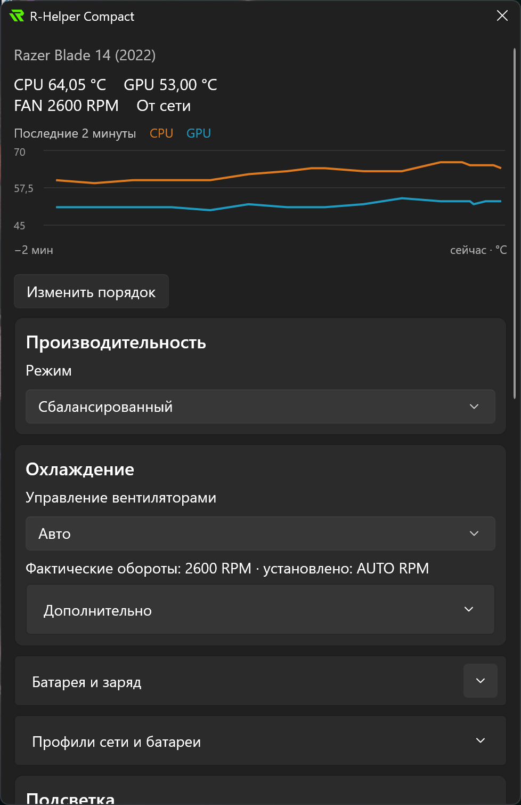
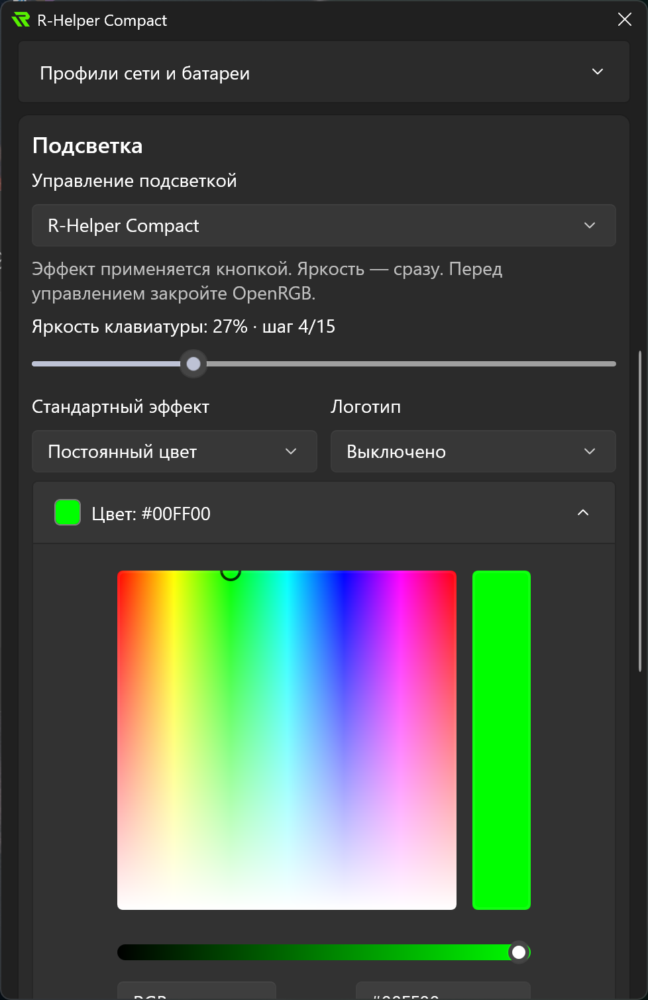

# R-Helper Compact


Управляйте производительностью, скоростью вентиляторов, подсветкой клавиатуры и пределом заряда ноутбуков Razer Blade из системного трея Windows.

[Релизы](https://github.com/e-khurmamatov/r-helper-compact/releases) · [Сообщить об ошибке](https://github.com/e-khurmamatov/r-helper-compact/issues/new/choose) · [English](README.md)

## Возможности

- Режимы производительности, вентиляторы и предел заряда батареи.
- Стандартные эффекты клавиатуры и передача управления подсветкой OpenRGB.
- Профили питания от сети и батареи, настройки Cooling Pad.
- Перестановка разделов, автозапуск и автоматический выбор языка.

Поддержка зависит от модели и прошивки. На неизвестных ноутбуках аппаратное управление заблокировано. Добавление моделей описано в [реестре устройств](devices/README.md).

## Скриншоты

<p>
  
  &nbsp;&nbsp;&nbsp;&nbsp;
  
</p>

Razer Blade 14 (2022). Доступность настроек зависит от модели ноутбука.

## Установка

Скачайте MSI или portable ZIP для x64 из раздела Releases. MSI устанавливает приложение в Program Files. Portable ZIP нужно распаковать целиком, затем запустить `rhelper-compact.exe`. Левый клик по значку в трее открывает настройки, правый — быстрые команды и выход. Перед обновлением закройте приложение.

Настройки хранятся в `%APPDATA%/r-helper-compact/`. Включены русский и английский языки; язык выбирается по настройкам Windows, остальные языки используют английский. Выбрать язык вручную можно в **Приложение → Настройки → Язык**; затем выйдите из приложения через меню трея и запустите его снова. Сборки пока без цифровой подписи.

В разделе **Приложение → Проверить обновления** можно проверить релизы GitHub. Установленная версия загружает проверенный MSI и перезапускается после обновления; Windows может запросить права администратора. Portable-версия загружает ZIP для ручной распаковки. Проверка запускается по кнопке; preview-сборки также получают предварительные релизы. Загрузки и журналы установки хранятся в `%LOCALAPPDATA%/r-helper-compact/updates/`.

## Сборка и участие

Нужны Windows x64, PowerShell 7, Python 3.11+, Visual Studio C++ Build Tools с Windows SDK, Rust 1.98.1 (MSVC) и .NET SDK 10.0.401.

```powershell
.\scripts/Build.ps1
python -m unittest discover -s tests -v
```

Все исходники находятся в репозитории: `controller/` — управление и обмен с интерфейсом, `librazer/` — протоколы устройств, `winui/` — интерфейс, `devices/` — реестр ноутбуков. Сборка не скачивает исходный R-Helper и не накладывает патчи. Происхождение проекта и авторы указаны в `THIRD_PARTY_NOTICES.md`.

[Участие](CONTRIBUTING.md) · [Добавление переводов](winui/Locales/README.md) · [Сборка релизов](RELEASING.md)

## Лицензия

Форк [R-Helper 0.8.5](https://github.com/Robak08/r-helper/tree/8f4ac7b2bc5b2cd077d73254dddb6873d1a5cab6) под лицензией MIT. Уведомления авторов сохранены в [LICENSE](LICENSE), [THIRD_PARTY_NOTICES.md](THIRD_PARTY_NOTICES.md) и [THIRD_PARTY_LICENSES.md](licenses/THIRD_PARTY_LICENSES.md). Независимый проект, не связанный официально с Razer.
